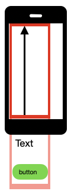

## Android 'UIScrollable' 滑动(swipe): 简单示例

Android的UIScrollable类在可滑动视图中查找元素方面很有效。大多数情况下，你应该使用"scrllInfoView"类来执行滑动相关的操作，使得目标元素出现在屏幕中。

Android UIScrollable的[开发文档](https://developer.android.google.cn/reference/androidx/test/uiautomator/UiScrollable)

以下场景我们可以使用UIScrollable滑动操作：  
- 在list中查找元素（例如，国家列表）
- 查找未出现在屏幕中的元素（例如，输入框，文本，按钮）


ScrollIntoView使用 UiSelector 作为查询标准，允许你使用以下方式进行查询元素：
- 文本 方式（文本内容可以为：精确匹配，包含，匹配，以此文本开始，或是正则文本）
- ID 方式 （支持 精确匹配或正则）
- 其他不常用的方式（参考对应的开发文档）
- 上述方式组合使用

Android UiSelector的[开发文档](https://developer.android.google.cn/reference/androidx/test/uiautomator/UiSelector)

此简单示例中，我们默认只有一个可滚动视图，滚动方向从屏幕底部滚动到顶部。



### 以 文本 查找

```java
// Page object
@AndroidFindBy(uiAutomator = "new UiScrollable(new UiSelector().scrollable(true))" +
        ".scrollIntoView(new UiSelector().text(\"exact_text\"))")
MobileElement element;

@AndroidFindBy(uiAutomator = "new UiScrollable(new UiSelector().scrollable(true))" +
        ".scrollIntoView(new UiSelector().textContains(\"part_text\"))")
MobileElement element;

// FindElement
MobileElement element = (MobileElement) driver.findElement(MobileBy.AndroidUIAutomator(
        "new UiScrollable(new UiSelector().scrollable(true))" +
         ".scrollIntoView(new UiSelector().text(\"exact_text\"))"));

MobileElement element = (MobileElement) driver.findElement(MobileBy.AndroidUIAutomator(
        "new UiScrollable(new UiSelector().scrollable(true))" +
         ".scrollIntoView(new UiSelector().textContains(\"part_text\"))"));
```

### 以 ID 查找

```java
// Page object
@AndroidFindBy(uiAutomator = "new UiScrollable(new UiSelector().scrollable(true))" +
        ".scrollIntoView(new UiSelector().resourceIdMatches(\".*part_id.*\"))")
MobileElement element;

// FindElement
MobileElement element = (MobileElement) driver.findElement(MobileBy.AndroidUIAutomator(
        "new UiScrollable(new UiSelector().scrollable(true))" +
         ".scrollIntoView(new UiSelector().resourceIdMatches(\".*part_id.*\"))"));

```

### ID和文本 组合查找

```java
// Page object
@AndroidFindBy(uiAutomator = "new UiScrollable(new UiSelector().scrollable(true))" +
        ".scrollIntoView(new UiSelector().resourceIdMatches(\".*part_id.*\").text(\"exact_text\"))")
MobileElement element;

// FindElement
MobileElement element = (MobileElement) driver.findElement(MobileBy.AndroidUIAutomator(
        "new UiScrollable(new UiSelector().scrollable(true))" +
         ".scrollIntoView(new UiSelector().resourceIdMatches(\".*part_id.*\").text(\"exact_text\"))"));

```


### 长视图问题

对于一些长视图，需要设置"setMaxSearchSwipes"的值。这个参数的值决定在停止查找之前，最多滑动几次。

```java
// set max swipes to 10
// FindElement
MobileElement element = (MobileElement) driver.findElement(MobileBy.AndroidUIAutomator(
        "new UiScrollable(new UiSelector().scrollable(true)).setMaxSearchSwipes(10)" +
         ".scrollIntoView(new UiSelector().text(\"exact_text\"))"));

```

